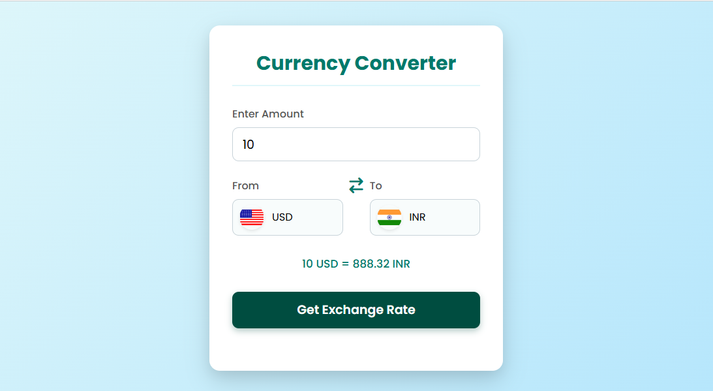

# Currency Converter

A simple web-based currency converter that allows users to convert amounts between different currencies with live exchange rates. The app also displays the corresponding country flag for each selected currency.

## Features

- Convert amounts between multiple currencies (USD, INR, EUR, GBP, JPY, AUD, etc.).
- Live exchange rates fetched from [Fawaz Ahmed's Currency API](https://github.com/fawazahmed0/currency-api).
- Dynamic country flags update based on the selected currency.
- Input validation: minimum amount set to 1.
- User-friendly interface with a dropdown for selecting "From" and "To" currencies.

## Screenshots

  <!-- Replace with your actual screenshot -->

## How to Use

1. Open `index.html` in a web browser.
2. Enter the amount to convert.
3. Select the "From" and "To" currencies from the dropdowns.
4. Click **Get Exchange Rate** to see the converted amount.
5. The country flags will update automatically based on your selections.

## Technologies Used

- HTML5
- CSS3
- JavaScript (Vanilla JS)
- [Flags API](https://flagsapi.com/) for country flags
- [Fawaz Ahmed Currency API](https://github.com/fawazahmed0/currency-api) for exchange rates

## Project Structure

